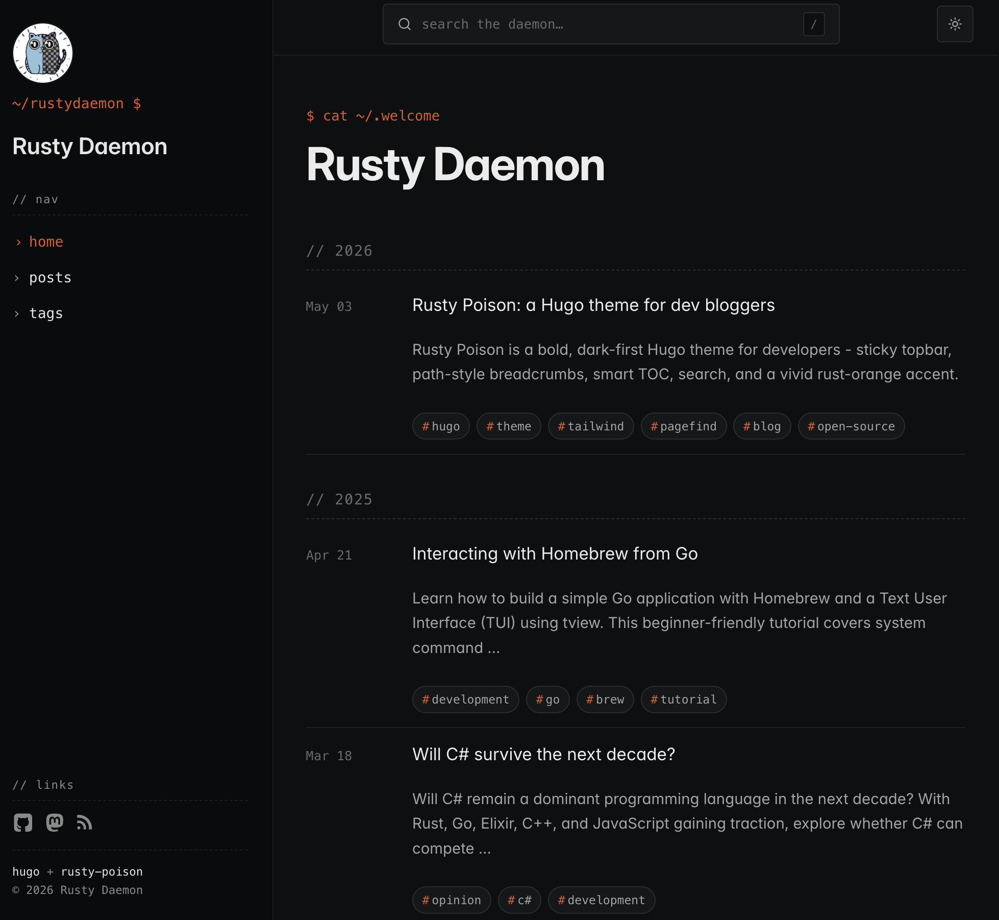
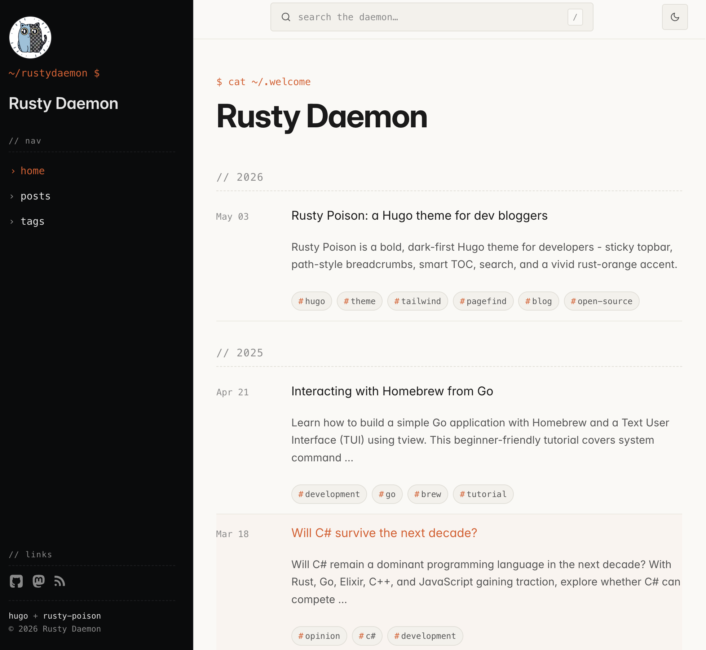
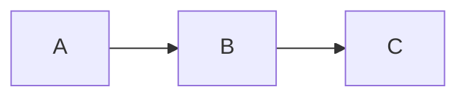

# Rusty Poison

A bold, distinctive Hugo theme for software developers. Two-column sidebar layout, dark-first with a polished
light mode, vivid rust-orange accent, modern type.

 

## Highlights

- **Sticky topbar** - search bar with `/` keyboard shortcut, theme toggle, full-width reading-progress bar on post pages.
- **Path-style breadcrumbs** - the source-file path is the breadcrumb; each segment links back to its directory.
- **Code blocks** - labeled header with language, line-wrap toggle, and copy button.
- **Static client-side search** via Pagefind.
- **Smart TOC** - sticky collapsible. Scroll-tracked active section highlighted in accent.
- **Related posts** weighted on tags + series.
- **Reading-experience extras** - reading progress bar, footnote popovers, image lightbox, GitHub-style callouts.
- **Rich content** - math passthrough (KaTeX-ready), Mermaid
  diagrams, image-optimization.

## Requirements

- Hugo extended **≥ 0.128** (uses the built-in `css.TailwindCSS` pipe).
- Node.js (for the dev dependencies - Tailwind CSS v4 CLI and Pagefind).

## Install

### As a submodule

```sh
git submodule add https://github.com/RustyDaemon/rusty-poison.git themes/rusty-poison
```

### As a clone

```sh
git clone https://github.com/RustyDaemon/rusty-poison themes/rusty-poison
```

### Wire it up

In `hugo.toml`:

```toml
theme = "rusty-poison"
```

Add the dev dependencies and a couple of npm scripts to your project's
`package.json`:

```json
{
  "scripts": {
    "dev": "hugo server -D",
    "build": "hugo --gc --minify && pagefind --site public",
    "search": "pagefind --site public"
  },
  "devDependencies": {
    "@tailwindcss/cli": "4.2.4",
    "tailwindcss": "4.2.4",
    "pagefind": "1.5.2"
  }
}
```

Then `npm install`.

## Usage

- `npm run dev` - `hugo server` with live reload. Search is disabled in dev because the Pagefind index lives under `public/` (regenerated from the built site).
- `npm run build` - production build + Pagefind index.
- For full local search testing: `npm run build && npx serve public`.

## Configuration

A minimal `hugo.toml`:

```toml
baseURL = "https://example.com/"
locale = "en-us"
title = "Your Site"
theme = "rusty-poison"
enableEmoji = true
pagination.pagerSize = 10

[params]
  brand = "Your Site"
  brand_image = "/images/logo.png"     # optional, lives in /static
  description = "Notes from..."        # default meta description
  tagline = "// short tagline"         # appears under the brand in the sidebar
  favicon = "/favicon.png"
  showDarkLight = true                 # show topbar theme toggle
  hideToc = false

  front_page_content = ["posts"]       # which sections show on the home page

  menu = [
    {Name = "posts", URL = "/posts/"},
    {Name = "tags",  URL = "/tags/"},
  ]

  github_url    = "https://github.com/you"
  mastodon_url  = "https://mastodon.social/@you"
  # bluesky_url, x_url, linkedin_url, youtube_url, discord_url, instagram_url,
  # facebook_url, email_url, twitter_url — all optional

  rss_icon    = true
  rss_section = "posts"

[taxonomies]
  series = "series"
  tags   = "tags"

[related]
  threshold = 80
  includeNewer = true
  toLower = false
  [[related.indices]]
    name = "tags"
    weight = 100
  [[related.indices]]
    name = "series"
    weight = 80
  [[related.indices]]
    name = "date"
    weight = 10

[markup]
  [markup.tableOfContents]
    startLevel = 2
    endLevel = 4
    ordered = false
  [markup.highlight]
    codeFences = true
    noClasses = false
    style = "monokai"     # cosmetic when noClasses=false; theme ships its own colors
    tabWidth = 2
  [markup.goldmark]
    [markup.goldmark.renderer]
      unsafe = true
    [markup.goldmark.extensions]
      [markup.goldmark.extensions.passthrough]
        enable = true
        [markup.goldmark.extensions.passthrough.delimiters]
          block  = [['\[', '\]'], ['$$', '$$']]
          inline = [['\(', '\)']]
```

### Front-matter knobs

```toml
title = "Post title"
date  = 2026-05-03
description = "Optional lede line under the title."
tags = ["go", "systems"]
series = "Some Series"          # custom taxonomy, renders the series list
hideToc = false                  # opt out of the TOC for this post
featuredImage = "/images/myimage.png"  # optional hero image
```

### Customizing colors

The accent and surface tokens live in
[`assets/css/main.css`](assets/css/main.css) under the `@theme` block. Edit them there - they propagate to the entire UI through CSS custom properties.

### Callouts

Use GitHub-style alert syntax inside markdown:

```md
> [!NOTE]
> Useful information that the user should know, even when skimming content.

> [!TIP]
> Helpful advice for doing things better or more easily.

> [!WARNING]
> Urgent info that needs immediate user attention.

> [!CAUTION]
> Negative potential consequences of an action.

> [!IMPORTANT]
> Crucial information necessary for users to succeed.
```

### Math

Goldmark passthrough is enabled, so `$inline$`, `\(inline\)`, `$$display$$`,
and `\[display\]` math is preserved in the output. Add a client-side
KaTeX/MathJax loader (or render server-side via `transform.ToMath` in a
shortcode) if you want the math rendered.

### Mermaid diagrams

Use a fenced code block with `mermaid`:

````md

````

The Mermaid runtime is loaded lazily and only when a `pre.mermaid` element
is present on the page.

### Details shortcode

```hugo

Click to reveal.

```

## License

Licensed under [Apache-2.0](LICENSE.md).

Fonts and other packages are licensed separately, see their respective documentation for details.
